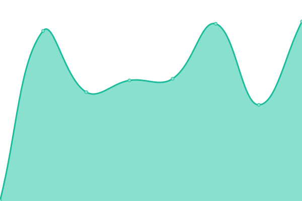

# [📈 Live Status](https://njc-paul.github.io/njc-uptime): <!--live status--> **🟥 Complete outage**

This repository contains the open-source uptime monitor and status page for [njc-paul](https://njc-paul.github.io/njc-uptime), powered by [Upptime](https://github.com/upptime/upptime).

With [Upptime](https://upptime.js.org), you can get your own unlimited and free uptime monitor and status page, powered entirely by a GitHub repository. We use [Issues](https://github.com/njc-paul/njc-uptime/issues) as incident reports, [Actions](https://github.com/njc-paul/njc-uptime/actions) as uptime monitors, and [Pages](https://njc-paul.github.io/njc-uptime) for the status page.

<!--start: status pages-->
<!-- This summary is generated by Upptime (https://github.com/upptime/upptime) -->
<!-- Do not edit this manually, your changes will be overwritten -->
<!-- prettier-ignore -->
| URL | Status | History | Response Time | Uptime |
| --- | ------ | ------- | ------------- | ------ |
|  [NJC Website](https://www.notjustcomputers.co.uk) | 🟥 Down | [njc-website.yml](https://github.com/njc-paul/njc-uptime/commits/HEAD/history/njc-website.yml) | 

 1148ms
     
 | 

<a href="https://njc-paul.github.io/njc-uptime/history/njc-website">99.64%</a>
    

|  [NJC Web01](https://njcweb01.njcserver.com) | 🟥 Down | [njc-web01.yml](https://github.com/njc-paul/njc-uptime/commits/HEAD/history/njc-web01.yml) | 

 462ms
     
 | 

<a href="https://njc-paul.github.io/njc-uptime/history/njc-web01">99.65%</a>
    

|  [NJC Web02](https://njcweb02.njcserver.com) | 🟥 Down | [njc-web02.yml](https://github.com/njc-paul/njc-uptime/commits/HEAD/history/njc-web02.yml) | 

 433ms
     
 | 

<a href="https://njc-paul.github.io/njc-uptime/history/njc-web02">99.61%</a>
    

<!--end: status pages-->

[**Visit our status website →**](https://njc-paul.github.io/njc-uptime)

## 📄 License

- Powered by: [Upptime](https://github.com/upptime/upptime)
- Code: [MIT](./LICENSE) © [njc-paul](https://njc-paul.github.io/njc-uptime)
- Data in the `./history` directory: [Open Database License](https://opendatacommons.org/licenses/odbl/1-0/)
